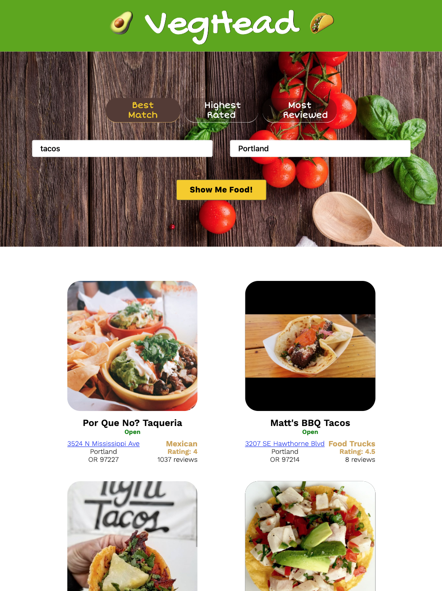

## VegHead

### Introduction

**VegHead**, is a single-page React app using Yelp's API to connect a user with the *best matched* and *highest rated* restaurants in a city or location (e.g. NE Portland) chosen by the user.

This app was originally part of a React course at Code Academy but is refactored and personalized here as "VegHead".

##### Start-up Server

To run the server, NPM or Yarn must be installed.

Open up the terminal and go to the project directory.  Inside of the project directory, run:

`npm install`

`npm start`

If you have Yarn installed run:

`yarn start`

This project was built using *Create React App*.  For complete technical details click [Create React App](./docs/#.md)

##### Technical Components
- Flexbox  
- Media queries used to build the *responsive design*.
- JavaScript (ECMASript 6)
- React 16.8.3

##### Attribution
[UI background picture by PXHere](https://pxhere.com/en/photo/1206442)

#### Picture of React Component Map

#### Pictures of Responsive Design
###### Phone

###### Tablet

<strong>Note</strong>: Some chord buttons are matched brown, purple, blue indicating these are enharmonic spellings of the same chord.

###### Desktop

#### Future Features
- Add Modal with Google map
- Add Favorites menu - store in local storage for now
